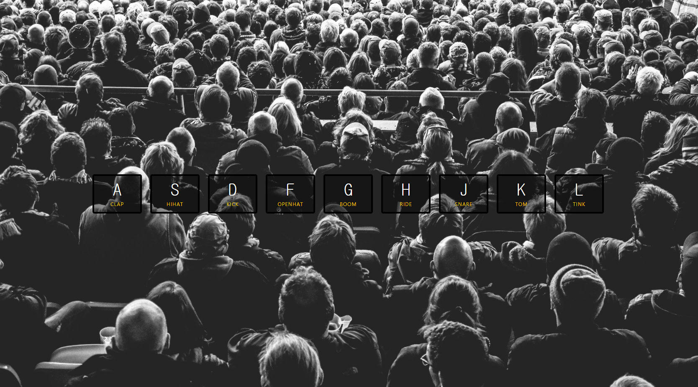

# JavaScript30 - day01

> 해당하는 키를 눌렀을 때 미리 설정해둔 소리가 재생되는 페이지
>
> 


## 1. transition, transform

- transition: css 속성을 변경할 때 애니메이션 속도를 조절한다.
- transform: 시각적 서식모델의 좌표 공간을 수정

<br>

## 2. keycode

keycode를 알 수 있는 사이트 : https://keycode.info/

<br>

## 3. data-key

`data-[something]` : something과 연결해 주는 역할

ex) `data-key="65"` : 'A' 키와 연결

<br>

## 4. 각 요소를 querySelector로 가져올 때 Tip

아래의 태그를 script에서 querySelector로 가져올 때, class를 주어서 가져올 수 도 있지만

```
<audio data-key="65" src="sounds/clap.wav"></audio>
```

<br>

아래와 같이 여러개가 있을 경우 하나하나 class를 주기 귀찮기에

```
<audio data-key="65" src="sounds/clap.wav"></audio>
<audio data-key="83" src="sounds/hihat.wav"></audio>
<audio data-key="68" src="sounds/kick.wav"></audio>
<audio data-key="70" src="sounds/openhat.wav"></audio>
<audio data-key="71" src="sounds/boom.wav"></audio>
<audio data-key="72" src="sounds/ride.wav"></audio>
<audio data-key="74" src="sounds/snare.wav"></audio>
<audio data-key="75" src="sounds/tom.wav"></audio>
<audio data-key="76" src="sounds/tink.wav"></audio>
```

<br>

아래와 같은 방법으로 가져올 수 있다. (keyCode는 data-key의 숫자를 뜻함)

```
const audio = document.querySelector(`audio[data-key="${e.keyCode}"]`)
```

