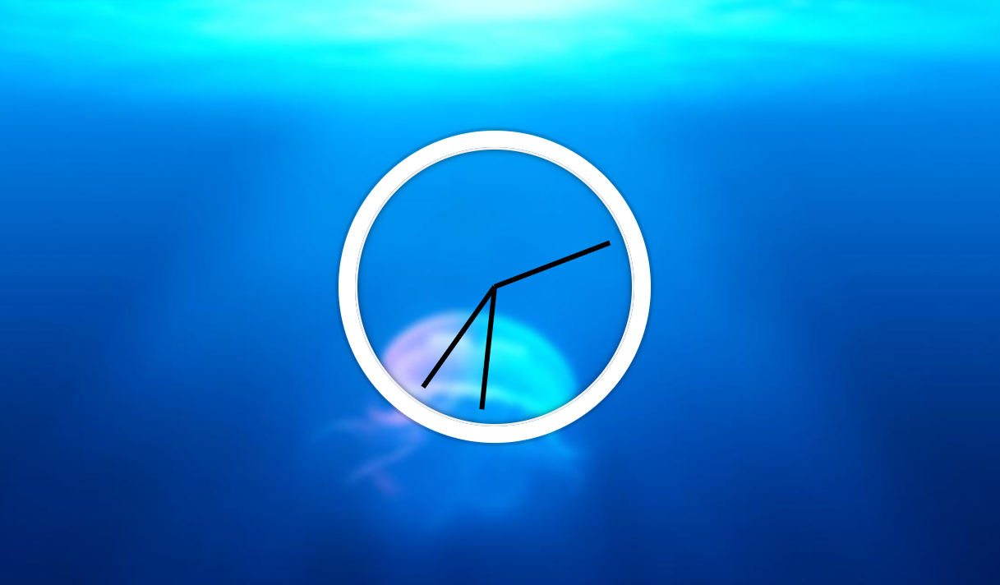

# Day02

> 현재시간을 나타내는 아날로그 시계 만들기
>
> 

<br>


## setInterval

setInterval : 일정 시간 간격을 두고 함수를 실행

```jsx
setInterval(setDate, 1000); // 1초마다 setDate 함수 실행
```

<br>


## getSeconds(), getMinutes(), getHours()

- now.getSeconds() : 현재 시간의 초
- now.getMinutes() : 현재 시간의 분
- now.getHours() : 현재 시간의 시간

<br>


## 현재시간을 나타내기 위한 JS 코드

```jsx
<script>
    const secondHand = document.querySelector('.second-hand');
    const minsHand = document.querySelector('.min-hand');
    const hourHand = document.querySelector('.hour-hand');
    
    function setDate() {
      const now = new Date();

      const seconds = now.getSeconds();
      const secondsDegrees = ((seconds / 60) * 360) + 90;
      secondHand.style.transform = `rotate(${secondsDegrees}deg)`;

      const mins = now.getMinutes();
      const minsDegrees = ((mins / 60) * 360) + ((seconds / 60) * 6) + 90;
      minsHand.style.transform = `rotate(${minsDegrees}deg)`;

      const hour = now.getHours();
      const hourDegrees = ((hour / 12) * 360) + ((mins / 60) * 30) + 90;
      hourHand.style.transform = `rotate(${hourDegrees}deg)`;
    }

    setInterval(setDate, 1000);

  </script>
```