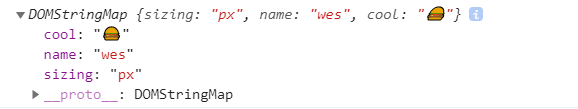

# Day03

> JS로 CSS 변수 업데이트 하기

<br>


## :root

아래처럼 root로 선언해놓고 계속 사용 가능

```jsx
:root {
      --base: #ffc600;
      --spacing: 10px;
      --blur: 10px;
    }

    img {
      padding: var(--spacing);
      background: var(--base);
      filter: blur(var(--blur))
    }
```


## dataset

thist.dataset : 해당 요소의 data 속성들을 담고 있다. (data-something 구조로 설정 가능)

```jsx
<input id="spacing" type="range" name="spacing" min="10" max="200" value="10" data-sizing="px" 
    data-name="wes" data-cool="🍔">
```

```jsx
console.log(this.dataset)
```

